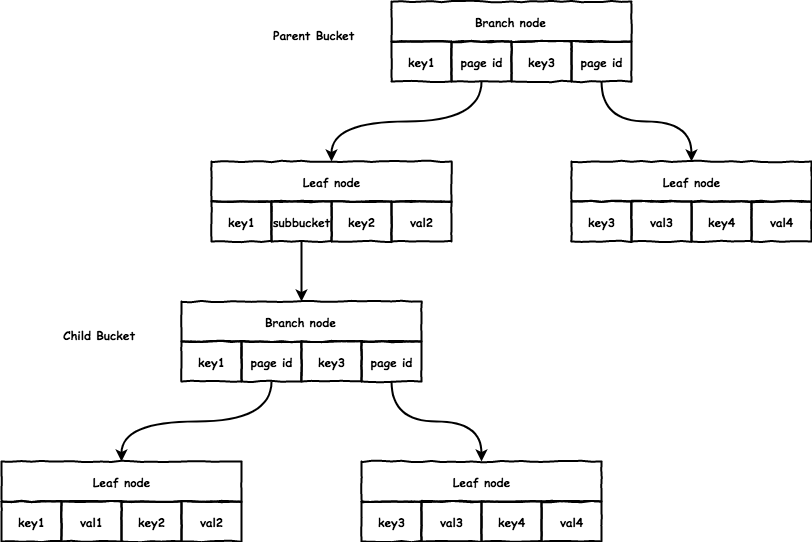
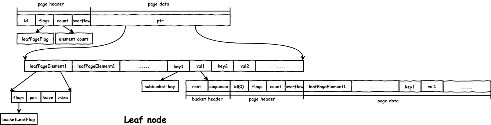

# BoltDB 源码分析

- [BoltDB 源码分析](#boltdb-源码分析)
  - [node](#node)
    - [CopyOnWrite解决读写冲突](#copyonwrite解决读写冲突)
  - [Element](#element)
  - [bucket](#bucket)
    - [cursor](#cursor)
  - [内存分配](#内存分配)
  - [inline bucket](#inline-bucket)
  - [Cursor](#cursor-1)
  - [rebalance](#rebalance)
  - [meta](#meta)
  - [bacth操作](#bacth操作)
  - [事务](#事务)
    - [原子性（Atomicity）](#原子性atomicity)
    - [一致性（Consistency）](#一致性consistency)
    - [隔离性（Isolation）](#隔离性isolation)
    - [持久性（Durability）](#持久性durability)
  - [难点](#难点)

---

BoltDB直接使用mmap, 直接将所有的页, 也就是整个数据大文件, 全部映射到内存内，从而免去了自己实现pagecache等等，简化了实现，并且数据持久化没有编解码，因此也避免了序列化的开销。尽管**Pavlo**在15-445里教导我们千万不要在数据库领域用mmap代替page cache。

## node

node为一个page在内存中的体现，也是数据插入的基本单元，每个node下存在innode，真正的存储kv

每个node都有children和innode（如果innode没有落盘，则不会分配pgid），并且有指针反指回parentNode

非leaf层的node节点至少要有2个inode元素

理论上，node中的元素，有一部分是mmap上来的指针地址，有一部分是新插入的元素。所以如果需要数据库需要resize重新mmap的时候，就需要将之前mmap的指针全部拷贝到内存中。因此数据库resize是个很重的操作。

### CopyOnWrite解决读写冲突

一般的数据库需要考虑"写写冲突", "读写冲突", 由于BoltDB只支持单写事务, 因此不存在"写写冲突";

现在考虑"读写冲突": 如果一个事务正在修改某个节点的数据, 但是还没提交, 那对于另一个读事务, 可能读到脏数据;

BoltDB使用了CopyOnWrite的方法, 对需要修改节点单保存一份（把之前的那个页的数据和增量数据都另存为到另外一个页上）;

当事务进行提交时, 将这些缓存的数据, 全部同步到磁盘;


## Element

分为`branchPageElement`和`leafPageElement`其中：

- `branchPageElement`指定了key的值和下一层的pgid，从而可以继续向下查找
- `leafPageElement`通过`flag`指明当前leaf的内容
  - `bucketLeafFlag`表明当前的leaf中存储的是其他的bucket，也就是**bucket-root**，一个blotDB存在唯一一个rootbucket
  - `flag==0`说明每个leaf里面是按顺序存放的kv对，通过成员变量`pos`标明位置

- `leafPageElement`

```txt
|page|leafPageElement|leafPageElement|leafPageElement|...|leaf key|leaf value|leaf key|leaf value|...|
```

- `branchPageElement`

```txt
|page|branchPageElement|branchPageElement|branchPageElement|...|branch key|branch key|...|
```

上层branchnode存放下层node的第一个key

## bucket

bucket是一些列的键值对的集合。一个bucket相当于一个命名空间，每个bucket中表示了一个完整的b+树，另外bucket可以嵌套。对数据的增删改查都基于bucket。

Bucket类比于mysql中的table，在boltdb中，**meta页面中有一个成员bucket，其存储了整个数据库根bucket的信息**，**而一个数据库中存储的其他table的信息，则作为子bucket存储到Bucket中**。其关系如下：

```go
type DB struct {
  // ...
	meta0    *meta
	meta1    *meta  
}
type meta struct {
  // ...
	root     bucket	// 根bucket的信息，通过这个可以找到根bucket的page，根bucket中存放所有的其他root bucket
  // |bucket|bucket|bucket|bucket|...|
  // 每个子bucket中再保存各种映射信息
}
type Bucket struct {
	*bucket
  // ...
  buckets  map[string]*Bucket // 存储子bucket的对应关系
}
type bucket struct {
	// 根节点的page id
	root pgid // page id of the bucket's root-level page
	// 单调递增的序列号
	sequence uint64 // monotonically incrementing, used by NextSequence()
}
```

子bucket保存在`leafPageElement`中，通过其中的元素flag来标识其是否是一个bucket

```go
// leafPageElement represents a node on a leaf page.
type leafPageElement struct {
	flags uint32
	pos   uint32
	ksize uint32
	vsize uint32
}

// key returns a byte slice of the node key.
func (n *leafPageElement) key() []byte {
	buf := (*[maxAllocSize]byte)(unsafe.Pointer(n))
	return (*[maxAllocSize]byte)(unsafe.Pointer(&buf[n.pos]))[:n.ksize:n.ksize]
}

// value returns a byte slice of the node value.
func (n *leafPageElement) value() []byte {
	buf := (*[maxAllocSize]byte)(unsafe.Pointer(n))
	return (*[maxAllocSize]byte)(unsafe.Pointer(&buf[n.pos+n.ksize]))[:n.vsize:n.vsize]
}
```

Bucket会有一个当前关联的事务`Tx`

综上，`boltdb` 支持嵌套的 `Bucket`，对于父 Bucket 而言，subbucket 只是特殊的 value 而已，设置 `leafPageElement.flags = bucketLeafFlag` 标记，而 subbucket 本身是一个完整的 B+ 树:



### cursor

我们创建了bucket之后，可以通过cursor进行递归查找，直到某个`leaf node`，cursor会维护一个栈，当找到时，栈顶元素就保存了对应的节点和位置（这个时候有两种可能，一是在内存中（node），二是在page中（持久化到磁盘））

## 内存分配

在一个bucket创建的时候，会创建与之对应的node。然后会开辟一片内存，存放存放bucketHeader和node的数据结构，具体代码在`Bucket::write()`函数中，内存分布如下：

```txt
内存中元素分布：
|bucketHeader||page header | leaf/branch element .... | kv pair ...  |

分布示意图：
|<--bucket-->|<--                  node...                        -->|
```

## inline bucket

如果子Bucket中的数据量很少，就会造成磁盘空间的浪费。为了针对这类型Bucket进行优化，boltdb提供了inline page这个特殊的页面，将小的子Bucket数据存放在这里。

这类型的子Bucket需要满足以下两个条件：

- 该子Bucket再没有嵌套的子Bucket了。
- 整个子Bucket的大小不能超过page size/4。



## Cursor

由于数据在inodes是按顺序存放的，因此我们通过cursor进行二分，他会从rootbucket向下查找，并将路上的element放入stack中。最终，stack顶部的元素就是叶子节点，可以可以进行CRUD操作。

首先通过`meta->root_`找到root—bucket，然后cursor就会从这个地方为起点进行search

## rebalance

由于CRUD操作是在内存中进行的，因此下刷磁盘的时候需要调整B+Tree结构。此时会涉及两个操作：

1. **rebalance**:删除操作会对node打上unbalanced标记，因为删除数据可能会引起page填充率不够，此时会对这些节点检查并进行合并。如果水位超过25%就不需要rebalance
   1. 情况一、当前的parent node只有一个节点，将下层的节点提升
   2. 情况二、当前node已经不存在任何inode了，需要移除
   3. 情况三、本层的两个node合并，选择相邻的两个节点，将右边节点的内容移入左边
2. **spill**：添加操作会使得page填充率过高，需要对节点进行分裂。如果超过水位（默认50%）就需要进行spill
   1. 实际spill的时候，首先在bucket层面进行spill自底向下spill（下一层分裂会影响到上面一层），在这个过程中spill node

简单来说，update操作涉及到的页都会新申请页，然后自底向上修改，在修改的同时将之前的页放回freeList，最后更新meta page，更新完成会后持久化各个节点。

## meta

Page1, Page2都被作为META_PAGE, 其原因是可用于人工backup。

1. 实际操作meta page的时候，会按照txid依次使用两个page，这样在事务的进行中，这两个page可以互为备份
2. BoltDB提供了一个Backup的接口, 使用这个接口后, 会将整个数据库文件, 重新拷贝一份。

## bacth操作

boltdb 不支持多个写事务同时执行，在创建写事务的时候会加上锁，不过 `boltdb` 提供了 `db.Batch()`:

当多个 goroutine 同时调用时，**会将多个写事务合并为一个大的写事务执行**。若其中某个事务执行失败，其余的事务会重新执行，所以要求事务是幂等的。

## 事务

Bolt中的事务类Tx代表具体的事务。

每次事务开始的时候（创建Tx类）的时候，创建rootBucket_，通过meta进行初始化

写事务需要将事务id加一。DB类中的锁保证同一时间只有一个写事务。读写事务通过读写锁进行并发控制。

### 原子性（Atomicity）

修改事务在事务开始时拷贝metadata

使用COW操作，所有的修改操作都在内存中完成，不会影响到数据库文件。但是每次update都要重写root到实际node的所有页，包括meta，meta page写入成功事务才算更新成功。如果任何一步写入失败，直接丢掉freelist中该事务分配的pageid，重新载入freelist即可。

### 一致性（Consistency）

写事务只有在metadata成功写入才算事务成功执行

### 隔离性（Isolation）

boltdb 支持多个读事务与一个写事务同时执行（拓宽了mysql读写锁的定义），写事务提交时会释放旧的 page，分配新的 page，**只要确保分配的新 page 不会是其他读事务使用到的就能实现 Isolation**。

在写事务提交时，释放的老 page 有可能还会被其他读事务访问到，不能立即用于下次分配，所以放在 `freelist.pending` 中， 只有确保没有读事务会用到时，才将相应的 pending page 放入 freelist.ids 中用于分配:

- freelist.pending: 维护了每个写事务释放的 page id。因为写事务开始时会拷贝一份meta，因此只要pending不被删除，原来的数据就可以一直被访问到。
- freelist.ids: 维护了可以用于分配的 page id。

每个事务都有一个 txid，db.meta.txid 保存了最大的已提交的写事务 id:

- 读事务: txid == db.meta.txid。
- 写事务：txid == db.meta.txid + 1。

当写事务成功提交时，会更新 metadata，也就更新了 db.meta.txid。

txid 相当于版本号，只有低版本的读事务才有可能访问高版本写事务释放的 node，当没有读事务的 txid 比该写事务的 txid 小时，就能释放 pending page 用于分配。

### 持久性（Durability）

使用两个meta page保证了一定的容错性，通过checksum校验数据完整性。

## 难点

1. 第一次手动实现数据库，操作数据节点的操作十分容易出错（递归查找）
2. 数据的分布关系经常容易记混，特别是在使用mmap之后
3. debug排查问题比一般的业务代码复杂繁琐，特别是指针指来指去容易出问题